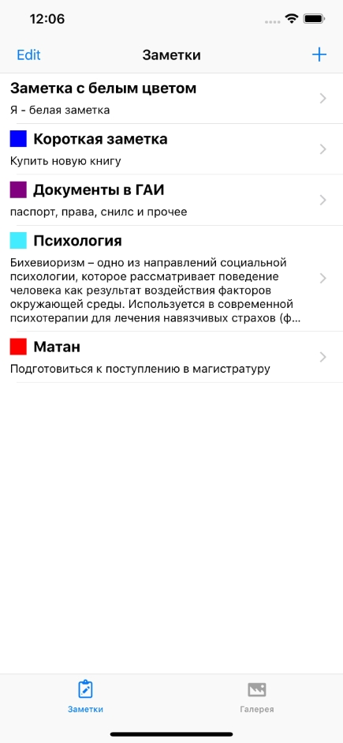

# Проект курса Академии Яндекса "Разработка под iOS. Начинаем"

Приложение реализовано в рамках курса и является учебным. Оно не претендует на звание лучшего приложения в мире и может иметь свои недостатки. По завершении курса был получен сертификат с отличием, который находится в папке Certificate.

 

# Функционал приложения

### Просмотр текстовых заметок
Реализован просмотр текстовых заметок через UITableView. Ячейки являются кастомными и реализованы в отдельном .xib файле.
Особенности ячейки:

 - изменение размера в зависимости от длины заметки (максимум 5 строк);
 - отображение цвета заметки, если он присутствует.
 

 

### Редактирование заметки
Экран редактирования заметки позволяет изменить следующие параметры:
 - название заметки;
 - содержание заметки;
 - дата удаления заметки;
 - цвет заметки.
 
Особенностями экрана являются:
 - контент помещен в ScrollView и адаптирован под различные размеры экрана iPhone;
 - квадратики цветов реализованы, как отдельный компонент класс UIView и могут быть переиспользованы в других проектах;
 - по умолчанию доступно три цвета. Четвертый блок выглядит как градиент и по долгому нажатию на него позволяет перейти на экран палитры;
 - галочка выбора текущего цвета.
 
 
 

 

### Палитра для выбора цвета заметки
Палитра является также самостоятельным компонентом приложения и реализована с помощью собственных классов UIView.

Функции палитры:
 - выбор цвета;
 - выбор насыщенности цвета.
 
В палитре присутствует "прицел" для более точного определения нужно цвета для пользователя.
 

 

### Галерея фотозаметок

Галерея представляет собой кастомный CollectionView. Пользователь имеет возможность добавлять свои фотографии из памяти устройства.

 

### Детальный просмотр фотозаметок
Реализован детальный просмотр галереи фотозаметок с использованием ScrollView на подобии галереи iPhone.

 

## Планируется сделать

 - [ ] исправить баг с насыщенностью цвета (не сохраняется при повторном открытии палитры);
 - [ ] добавление и сохранение заметок с использованием CoreData.
 
